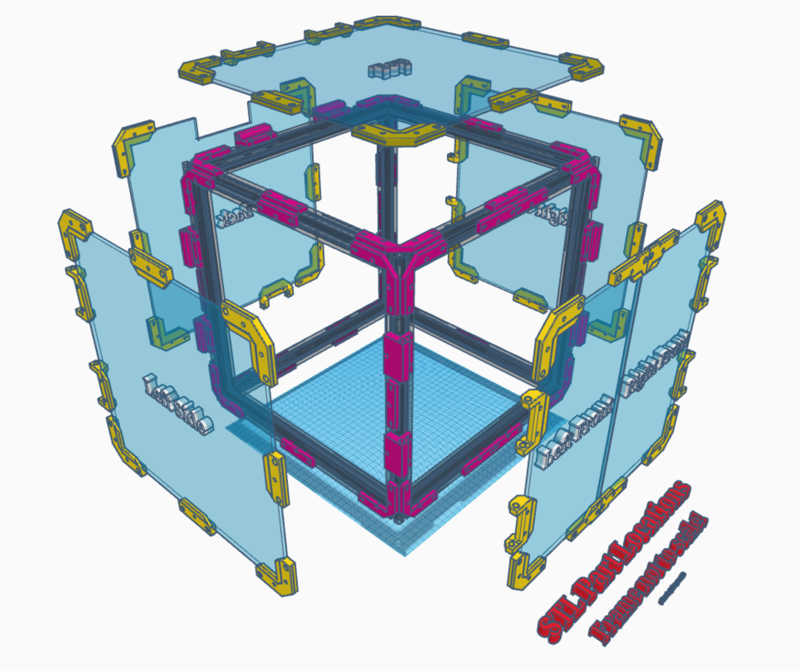
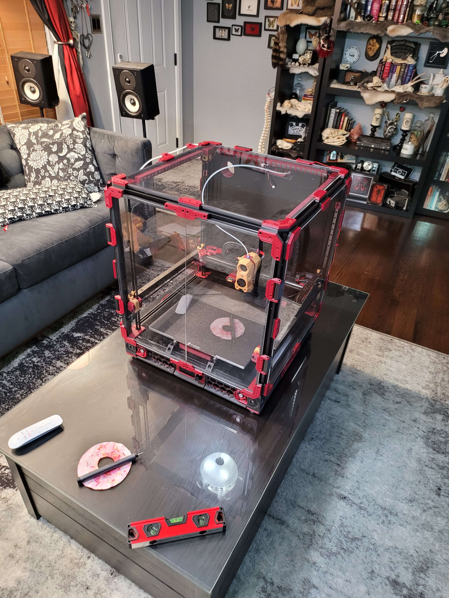
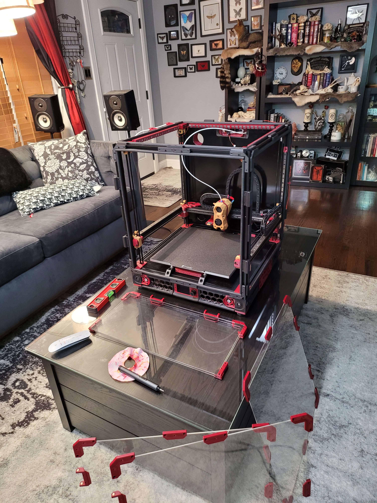

# **EMP - The Excessively Magnetic Panel Mod**
# **<WARNING: INCOMPLETE DOCS BELOW>**

Jump to: 
- [BOM](#boms-and-tool-lists)

## Description:
This mod converts every panel on the Voron to a well sealed, removable magnetic doors with all-magnetic >180° (Closer to 200°) degree hinges. All panels function as doors and are removable with no hardware what so ever, just yank 'em out!

### Quick Youtube Demo:

There are 2 variants of this panel mod:

### "All Doors"
This is the intended original design. Requires more magnets and hardware, but allows you to open every single panel on your Voron (including the back and top!) like a hinged door or just yank them all off with no hardware.

### "Voron Spec"
Exactly the same configuration as standard Voron panels, except with all the benefits of the magnet panels and hinges. This mod was designed with "All Doors" in mind, but for users who don't need this functionality, using the "Voron Spec" configuration will save you a ton of hardware and simplify installation.

# BOMs and Tool Lists:

## Tools (You have them already):
- **Small Hammer** for tapping magnets gently into place. Doesn't even have to be a hammer, you should not need much force at all. A rubber mallet also works well.
- **1x m3x20 SHCS or similar length screw** to use with the hammer. You just need an m3 SHCS long enough you can hold it with your fingers while you use the hammer.
- **Flat, solid surface** for hammering.
- **2.5mm Hex Key.**
- **Metric Ruler** at least 10cm long. (Calipers, measuring tape, etc, also work fine.)
- **Scissors** for the VHB tape. You'll want nice, sharp and clean ones.
- **A few seasons of The Office** while assembling the hardware prior to installation. (Can supplement with your show of choice.)

## "All Doors" BOM:
- **236x** - *6x3mm Disc Magnets (Grade n52 Recommended)*
  - [Source: West3d](https://west3d.com/products/6mm-x-3mm-round-neomydium-magnets)
- **89x** - *M3x8mm SHCS Screws*
- **69x** - *Hammerheads, Roll In T-Nuts or Springnuts*, nice.
- **20x** - *Roll In T-Nuts or Springnuts (This is in addition to above)*
- **Approx. 2 Meters / 6.7 Feet** - *0.4 Inch VHB Tape*
  - [Source: Lifetime Supply off Amazon](https://www.amazon.com/gp/product/B0CLV11RT9/)
- **Approx. 10 Meters / 33 Feet** - *9mm/8mm Weatherseal* (M-D Brand, Part No. 01025 Recommended)
  - [Source: Amazon](https://www.amazon.com/Multipurpose-Seasons-Marine-Window-Weather/dp/B000HE7YQM) - 2 Packages of 17ft.
  - [U.S. Source: Home Depot](https://www.homedepot.com/p/M-D-Building-Products-17-ft-Black-Small-Rubber-Auto-Marine-Weatherseal-for-All-Climates-01025/202066509) - 2 Packages.
  - [U.S. Source: Ace Hardware](https://www.acehardware.com/departments/building-supplies/weather-stripping-and-window-film/weather-stripping/5315445) - 2 Packages.
  - [U.S. Source: Lowes](https://www.lowes.com/pd/M-D-17-ft-x-11-32-in-Black-Rubber-Foam-Window-Weatherstrip/1038915) - 2 Packages.
  
## "Voron Spec" BOM:
- **188x** - *6x3mm Disc Magnets (Grade n52 Recommended)*
  - [Source: West3d](https://west3d.com/products/6mm-x-3mm-round-neomydium-magnets)
- **71x** - *M3x8mm SHCS Screws*
- **63x** - *Hammerheads, Roll In T-Nuts or Springnuts*
- **8x** - *Roll In T-Nuts or Springnuts (This is in addition to above)*
- **Approx. 1.8 Meters / 5.9 Feet** - *0.4 Inch VHB Tape*
  - [Source: Lifetime Supply off Amazon](https://www.amazon.com/gp/product/B0CLV11RT9/)
- **Approx. 10 Meters / 33 Feet** - *9mm/8mm Weatherseal* (M-D Brand, Part No. 01025 Recommended)
  - [Source: Amazon](https://www.amazon.com/Multipurpose-Seasons-Marine-Window-Weather/dp/B000HE7YQM) - 2 Packages of 17ft.
  - [U.S. Source: Home Depot](https://www.homedepot.com/p/M-D-Building-Products-17-ft-Black-Small-Rubber-Auto-Marine-Weatherseal-for-All-Climates-01025/202066509) - 2 Packages.
  - [U.S. Source: Ace Hardware](https://www.acehardware.com/departments/building-supplies/weather-stripping-and-window-film/weather-stripping/5315445) - 2 Packages.
  - [U.S. Source: Lowes](https://www.lowes.com/pd/M-D-17-ft-x-11-32-in-Black-Rubber-Foam-Window-Weatherstrip/1038915) - 2 Packages.

## Per STL BOM (Ref. Full Part Descriptions Above):
- *[a]hinge_frame_<SIZE>.stl*
  - **4 Magnets, 3 Screws, 1 Hammerhead, 2 T-nuts/Springnuts**
- *[a]hinge_frame_bottom_<SIZE>.stl*
  - **4 Magnets, 2 Screws, 2 Hammerheads**
- *[a]corner_frame_<SIZE>.stl*
  - **2 Magnets, 2 Screws, 2 Hammerheads**
- *[a]side_frame_<SIZE>.stl*
  - **2 Magnets, 1 Screw, 1 Hammerhead**
- *hinge_panel_<SIZE>.stl*
  - **4 Magnets, 40mm VHB tape**
- *door_clip_1_<SIZE>.stl*
  - **2 Magnets, 20mm VHB tape**
- *door_clip_2_<SIZE>.stl*
  - **2 Magnets, 20mm VHB tape**
- *corner_panel_<SIZE>.stl*
  - **2 Magnets, 60mm VHB tape**
- *side_panel_<SIZE>.stl*
  - **2 Magnets, 20mm VHB tape**

# The Magnet Tolerance Test:
## (Don't skip!!)

Print one magnet_test.stl for every filament you plan to use for this mod, some filaments behave surprisingly differently!

You are looking for a "snug" but not "tight" fit. You should be able to start the magnets with your hands and some pressure. You **do not** need to seat them all the way down at this step. The fastest way to find the correct holes is to start by inserting a magnet into the *largest* bottom hole (L), if the magnet falls in or can be yanked back out with another magnet, try the next smallest hole. The goal is to find one you can shove part of the way in with your hands and can't be yanked back out with another magnet.

Repeat the same steps on the top/vertical holes. An ideal situation is you pick both the same size holes for the top and bottom. But due to print orientation and everyone's printer being just a little different, you may find yourself needing to go up or down a size on the vertical holes.

The sizes of the holes are as follows:
- XS
  - Horizontal: 6.0mm
  - Vertical: 5.9mm
- S
  - Horizontal: 6.1mm
  - Vertical: 6.0mm
- M (This is what I use)
  - Horizontal: 6.2mm
  - Vertical: 6.1mm
- L 
  - Horizontal: 6.3mm
  - Vertical: 6.2mm

# STL Print Requirements:
After selecting the hole size, now it's time to print the STLs! Select the set of parts that match the hole size you've selected. The top/vertical holes are for the hinges, the horizontal holes were for all other parts.

All prints are designed to print to Voron Spec profiles. If you have warping issues, these parts need very little cooling, all of mine were printed with only about a 5% fan speed on a Stealthburner/G2E/Revo setup. I also ran some experiments and found all the parts can be printed with no cooling what so ever, but YMMV.

## For "All Doors":
### Print with top/vertical hole size:
- **10x** *[a]hinge_frame_SIZE.stl*
- **2x** *[a]hinge_frame_bottom_SIZE.stl*
- **12x** *hinge_panel_SIZE.stl*

### Print with bottom/horizontal hole size:
- **20x** *[a]corner_frame_SIZE.stl*
- **15x** *[a]side_frame_SIZE.stl*
- **2x** *door_clip_1_SIZE.stl*
- **2x** *door_clip_2_SIZE.stl*
- **20x** *corner_panel_SIZE.stl*
- **11x** *side_panel_SIZE.stl*

## For "Voron Spec":
### Print with top/vertical hole size:
- **4x** *[a]hinge_frame_SIZE.stl*
- **4x** *hinge_panel_SIZE.stl*

### Print with bottom/horizontal hole size:
- **20x** *[a]corner_frame_SIZE.stl*
- **19x** *[a]side_frame_SIZE.stl*
- **2x** *door_clip_1_SIZE.stl*
- **2x** *door_clip_2_SIZE.stl*
- **20x** *corner_panel_SIZE.stl*
- **15x** *side_panel_SIZE.stl*

# Assembly:
## Magnets
First step is to insert all of the magnets into all of the STLs. It's very important to get the polarity correct. Be aware of the orientation of the parts in the example images.

I've found the best method to insert the magnets is to hand push in the magnet until it's halfway in, and then use the head of an M3x14mm screw and attach it to the magnet, then lightly tap the magnet down in place with a hammer. It makes assembly go much faster. Just be sure to use a flat surface so you don't blow the magnet straight through the hole!

## Hardware
You may preload all the hardware **EXCEPT FOR** the T-nuts noted in red. These must be loaded into the extrusions and slid into place **after** installation of the door hinge.

## VHB Tape
Don't skimp on the VHB tape! When installed, press down extremely hard on the panels. VHB tape sticks better over time, but initially is can be somewhat weak, and the larger panels may try to pop off the first couple days.

# **INCOMPLETE DOCS BELOW**
# **INCOMPLETE DOCS BELOW**
# **INCOMPLETE DOCS BELOW**
## **ONLY REFERENCES "ALL-DOORS" AS OF READING THIS **

# Installation:

## Provided is a direct link to the STL Placement Reference both on Tinkercad and GitHub. Both will show you the location of every STL in 3d space. *Note its not remotely to scale, that's why everything looks ridiculously cramped.*

# View the Full Model STL Placement Reference on:
# [Fully Editable and Color Coded, Tinkercad](https://www.tinkercad.com/things/gM3WwlMIWih-emp-stl-placement-reference)
# [Uneditable and Grey Scale, GitHub](Images/placement_reference.stl)

Refer to the following images or the Tinkercad link above for clip placement on the various panels. Apply significant pressure to the tape to ensure it sticks. In my experience, the VHB tape may be a bit weak the first few days but should all hold together just fine. I like to occasionally revisit this and push the clips down a bit more as I work through the project just to make sure they're staying down.

From here on out, all stl's names will be shortened for brevity.

Left and Right Panels:
- *corner_panel* are placed in the 4 corners of the panel.
- *side_panel* are placed on the top, bottom and front sides of the panel, in the center.
- *hinge_panel* are placed 10cm from the edge of the panel on the back side. 

Left and Right Frames: (Same as above, just on the frames.)
- *corner_frame* are placed in the 4 corners of the panel.
- *side_frame* are placed on the top, bottom and front sides of the panel, in the center.
- *hinge_frame* are placed 10cm from the edge of the panel on the back side. 

Top Panel:
- corner_panel.stl are placed in the 4 corners of the panel.
- side_panel.stl are placed on 3 of the 4 sides in the center.
- hinge_panel.stl are placed 10cm from the edge of the panel on one side. 

**Images here**

When installing the frame STLs, install them loose initially (just tight enough they don't fall out), you'll use the panels themselves to align the frame STLs in a future step. Place them in the same locations as the panel clips, just on the frame.

- corner_panel.stl are placed in the 4 corners.
- side_panel.stl are placed on 3 of the 4 sides in the center.
- hinge_panel.stl are placed 10cm from the edge of the panel on one side. 

Refer to the following images for frame placement on the various extrusions:
**Images here**

Slide/place the side_frame.stl and hinge_frame.stl parts under their respective _panel. You may have to loosen them a tad if you used hammerheads.

**With the panel installed and attached to the magnets**, tighten the _frame.stl parts **through** the _panel.stls with the guide holes provided. Use your hands to hold the _frame.stl and _panel.stl flush with eachother while tightening for better alignment.

**Image Here**

Install the T-Nuts for the hinges and slide them under hinge_frame.stl

**Image Here**

The weatherseal is placed on last so you don't accidentally tear it while installing the frame STLs, if want the weatherseal placed flush along the inner side of the extrusion. If you purchased the same brand I did, many times the adhesive isn't aligned, use this to your advantage so you don't have any exposed adhesive.

**Images here**

Installation should be complete at this point. This is where you'll need to look at the overall fit and finish, verify everything looks nice and lined up and even when the doors/panels are installed/closed.

Be gentle with the hinges for a few days while the VHB tape settles (ie; don't leave them hanging open on their own weight overnight). I like to give the clips a good squish against the panel here and there as I'm working with the printer, just to be sure.

If you have serious issues with the VHB tape holding to the parts post install, there's a few things you can try:
- Lightly sand the clips and replace new tape. Ironically a really well tuned printer with a really good top layer will have less adhesion with the tape. So grats on a good top layer if this is you!
- If all else fails and you're working with a filament that just won't stick to the tape no matter what you do, a **very** thin layer of super glue between the tape and panel clips will perma-bond it forever. **Just be extremely careful not to get it on your panels, it'll ruin them!!!**. If you must do this, I recommend applying the glue to the clip/tape and letting it fully dry before reattaching them to the panels to avoid any superglue leaking on to the panel. Ideally, no one should have to use glue. But with 10,000,000 brands of ABS and ASA out there, some may just be more stubborn than others.

Done?

# Optional
- All _panel STL files, except the hinges, can have an additional magnet added if you want to go overkill with magnet strength. Note that this will add an enormous amount of extra magnets (Roughly 25-30% more) to the BOM.
- You can rearrange everything, adding or moving hinges and clips where you desire.

# Mod Compatibility
- This has not been tested with the [Clicky-Clack Fridge Door Mod](https://github.com/tanaes/whopping_Voron_mods/tree/main/clickyclacky_door), but should theoretically work if you omit the side clips interfering with the Fridge Mod's hinge. There is a possibility it may rub against the side panel. Please let me know if this is an issue!
- This should work with just about any mod that doesn't have an issue with the panels being pushed outwards about 6-8mm from the frame.

# Coming Soon (Before full release)
- A magnetic door handle of some sort.
- Small magnetic arms to prop doors open.

# Real Life Install Photos

# Ignore below this line, I'm just too lazy to put notes anywhere else at the moment..

### Per STL breakdown for All Doors:
- [a]hinge_frame_<SIZE>.stl
  - 48 Magnets, 36 Screws, 12 Hammerhead, 24 T-nuts
- [a]corner_clip_frame_<SIZE>.stl
  - 40 Magnets, 40 Screws, 40 Hammerheads
- [a]side_clip_frame_<SIZE>.stl
  - 30 Magnets, 15 Screw, 15 Hammerhead
- hinge_panel_<SIZE>.stl
  - 48 Magnets, 480mm VHB tape
- door_clip_1_<SIZE>.stl
  - 4 Magnets, 40mm VHB tape
- door_clip_2_<SIZE>.stl
  - 4 Magnets, 40mm VHB tape
- corner_clip_panel_<SIZE>.stl
  - 40 Magnets, 1200mm VHB tape
- side_clip_panel_<SIZE>.stl
  - 22 Magnets, 220mm VHB tape
  
### Per STL breakdown for Voron Spec:
- [a]hinge_frame_<SIZE>.stl
  - 16 Magnets, 12 Screws, 4 Hammerhead, 8 T-nuts
- [a]corner_clip_frame_<SIZE>.stl
  - 40 Magnets, 40 Screws, 40 Hammerheads
- [a]side_clip_frame_<SIZE>.stl
  - 38 Magnets, 19 Screw, 19 Hammerhead 
- hinge_panel_<SIZE>.stl
  - 16 Magnets, 160mm VHB tape
- door_clip_1_<SIZE>.stl
  - 4 Magnets, 40mm VHB tape
- door_clip_2_<SIZE>.stl
  - 4 Magnets, 40mm VHB tape
- corner_clip_panel_<SIZE>.stl
  - 40 Magnets, 1200mm VHB tape
- side_clip_panel_<SIZE>.stl
  - 30 Magnets, 300mm VHB tape
