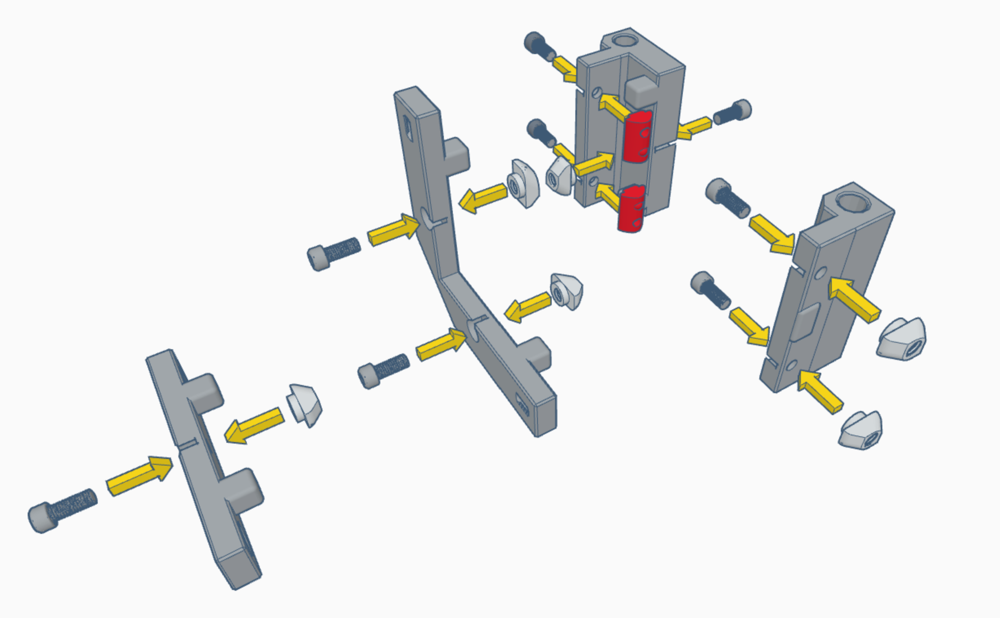

# **EMP - The Excessively Magnetic Panel Mod**

## Description:
This mode converts every panel on the Voron to a well sealed, removable magnet doors with magnetic hinges. All panels function as doors and are removable with no hardware what so ever, just yank 'em out!

There are 2 variants of this panel mod:

### "All Doors"
Requires more magnets and hardware, but allows you to open every single panel on your Voron (including the back and top!) like a hinged door or just yank them all off with no hardware.

### "Voron Spec"
Exactly the same configuration as standard Voron panels, except all magnetic and removable without hardware, with the new seal.

This mod was designed with "All Doors" in mind, but for users who don't need this functionality, using the "Voron Spec" configuration will save you a ton of hardware and simplify installation.

## "All Doors" BOM:
- 6x3mm Disc Magnets (Grade n52 Recommended)  - 236ea ([Source: West3d](https://west3d.com/products/6mm-x-3mm-round-neomydium-magnets))
- M3x8mm SHCS Screws                          - 91ea
- M3 Hammerhead, T-Nut or Springnut           - 67ea
- M3 T-Nut (This is in addition to above)     - 24ea
- 0.4 Inch VHB Tape                           - Approx. 2 Meters / 6.7 Feet ([Lifetime Supply off Amazon](https://www.amazon.com/gp/product/B0CLV11RT9/))
- 9mm/8mm Weatherseal                         - Approx. 10 Meters / 33 Feet ([Local Source in U.S.](https://www.homedepot.com/p/M-D-Building-Products-17-ft-Black-Small-Rubber-Auto-Marine-Weatherseal-for-All-Climates-01025/202066509) - 2 Packages )

### Per STL breakdown:
- [a]hinge_frame_<SIZE>.stl                 - 48 Magnets, 36 Screws, 12 Hammerhead, 24 T-nuts
- [a]corner_clip_frame_<SIZE>.stl           - 40 Magnets, 40 Screws, 40 Hammerheads
- [a]side_clip_frame_<SIZE>.stl             - 30 Magnets, 15 Screw, 15 Hammerhead
- hinge_panel_<SIZE>.stl                    - 48 Magnets, 480mm VHB tape
- door_clip_1_<SIZE>.stl                    - 4 Magnets, 40mm VHB tape
- door_clip_2_<SIZE>.stl                    - 4 Magnets, 40mm VHB tape
- corner_clip_panel_<SIZE>.stl              - 40 Magnets, 1200mm VHB tape
- side_clip_panel_<SIZE>.stl                - 22 Magnets, 220mm VHB tape

## "Voron Spec" BOM:
- 6x3mm Disc Magnets (Grade n52 Recommended)  - 188ea ([Source: West3d](https://west3d.com/products/6mm-x-3mm-round-neomydium-magnets))
- M3x8mm SHCS Screws                          - 71ea
- Hammerhead, T-Nut or Springnut              - 63ea
- T-Nut (This is in addition to above)        - 8ea
- 0.4 Inch VHB Tape                           - Approx. 1.8 Meters / 5.9 Feet ([Source: Lifetime Supply off Amazon](https://www.amazon.com/gp/product/B0CLV11RT9/))
- 9mm/8mm Weatherseal                         - Approx. 10 Meters / 33 Feet ([Source: Local Source in U.S, Home Depot](https://www.homedepot.com/p/M-D-Building-Products-17-ft-Black-Small-Rubber-Auto-Marine-Weatherseal-for-All-Climates-01025/202066509) - 2 Packages )

### Per STL breakdown:
- [a]hinge_frame_<SIZE>.stl                 - 16 Magnets, 12 Screws, 4 Hammerhead, 8 T-nuts
- [a]corner_clip_frame_<SIZE>.stl           - 40 Magnets, 40 Screws, 40 Hammerheads
- [a]side_clip_frame_<SIZE>.stl             - 38 Magnets, 19 Screw, 19 Hammerhead 
- hinge_panel_<SIZE>.stl                    - 16 Magnets, 160mm VHB tape
- door_clip_1_<SIZE>.stl                    - 4 Magnets, 40mm VHB tape
- door_clip_2_<SIZE>.stl                    - 4 Magnets, 40mm VHB tape
- corner_clip_panel_<SIZE>.stl              - 40 Magnets, 1200mm VHB tape
- side_clip_panel_<SIZE>.stl                - 30 Magnets, 300mm VHB tape

## Per STL BOM (Ref. Full Part Descriptions Above):
- [a]hinge_frame_<SIZE>.stl                 - 4 Magnets, 3 Screws, 1 Hammerhead, 2 T-nuts
- [a]corner_clip_frame_<SIZE>.stl           - 2 Magnets, 2 Screws, 2 Hammerheads
- [a]side_clip_frame_<SIZE>.stl             - 2 Magnets, 1 Screw, 1 Hammerhead
- hinge_panel_<SIZE>.stl                    - 4 Magnets, 40mm VHB tape
- door_clip_1_<SIZE>.stl                    - 2 Magnets, 20mm VHB tape
- door_clip_2_<SIZE>.stl                    - 2 Magnets, 20mm VHB tape
- corner_clip_panel_<SIZE>.stl              - 2 Magnets, 60mm VHB tape
- side_clip_panel_<SIZE>.stl                - 2 Magnets, 20mm VHB tape

# The Magnet Tolerance Test:
## (Don't skip!!)

Print one magnet_test.stl for every filament you plan to use for this mod, some filaments behave very surprisingly differently!

You are looking for a "snug" but not "tight" fit. You should be able to start the magnets with your hands and some pressure, but perhaps have to (very lightly) tap them with a small tool (I used a hammer and M3x20 screw with the screwhead on the magnet) to seat them all the way down.

The fastest way to find the correct holes is to start by inserting a magnet into the *largest* bottom hole (L), if the magnet falls in or can be yanked back out with another magnet, try the next smallest hole. The goal is to find one you can shove most of the way in with your hands and can't be yanked back out with another magnet.

Repeat the same steps on the top/vertical holes. An ideal situation is you pick both the same size holes for the top and bottom. But due to print orientation and everyone's printer being just a little different, you may find yourself needing to go up or down a size on the vertical holes.

# STL Print Requirements:
After selecting the hole size, now it's time to print the STLs! Select the set of parts that match the hole size you've selected. The top/vertical holes are for the hinges, the horizontal holes were for all other parts.

All prints are designed to print to Voron Spec profiles. If you have warping issues, these parts need very little cooling, all of mine were printed with only about a 5% fan speed on a Stealthburner.

## For "All Doors":
### Print with top/vertical hole size:
- **12x** *[a]hinge_frame_SIZE.stl*
- **12x** *hinge_panel_SIZE.stl*

### Print with bottom/horizontal hole size:
- **20x** *[a]corner_clip_frame_SIZE.stl*
- **15x** *[a]side_clip_frame_SIZE.stl*
- **2x** *door_clip_1_SIZE.stl*
- **2x** *door_clip_2_SIZE.stl*
- **20x** *corner_clip_panel_SIZE.stl*
- **11x** *side_clip_panel_SIZE.stl*

## For "Voron Spec":
### Print with top/vertical hole size:
- **4x** *[a]hinge_frame_SIZE.stl*
- **4x** *hinge_panel_SIZE.stl*

### Print with bottom/horizontal hole size:
- **20x** *[a]corner_clip_frame_SIZE.stl*
- **19x** *[a]side_clip_frame_SIZE.stl*
- **2x** *door_clip_1_SIZE.stl*
- **2x** *door_clip_2_SIZE.stl*
- **20x** *corner_clip_panel_SIZE.stl*
- **15x** *side_clip_panel_SIZE.stl*

# Assembly:
## Magnets
First step is to insert all of the magnets into all of the STLs. It's very important to get the polarity correct. Be aware of the orientation of the parts in the example images.

I've found the best method to insert the magnets is to use hand push in the magnet until it's halfway in, and then use the head of an M3x14mm screw and attach it to the magnet, then lightly tapthe magnet down in place with a hammer. It makes assembly go much faster. Just be sure to use a flat surface so you don't blow the magnet straight through the hole!

##Hardware

##VHB Tape

